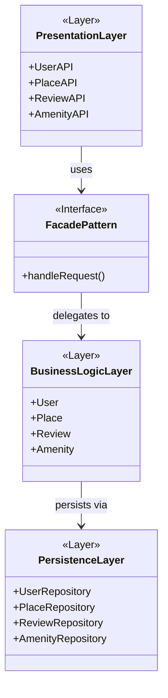

# HBnB Evolution - Technical Documentation

## Part 1: Application Architecture

---

## Task 0: High-Level Package Diagram

### Overview

The HBnB application follows a three-layer architecture where each layer has a
specific responsibility. Layers communicate through the Facade Pattern, which
acts as a simplified interface between them.

### Layer Descriptions

**Presentation Layer**
Handles all interaction between the user and the application.
Exposes REST API endpoints for Users, Places, Reviews, and Amenities.

**Facade Pattern**
Acts as a single entry point between the Presentation and Business Logic layers.
Simplifies communication by hiding internal complexity.

**Business Logic Layer**
Contains the core models and business rules.
Entities: User, Place, Review, Amenity.

**Persistence Layer**
Responsible for storing and retrieving data from the database.
Each entity has its own repository handling database operations.

---