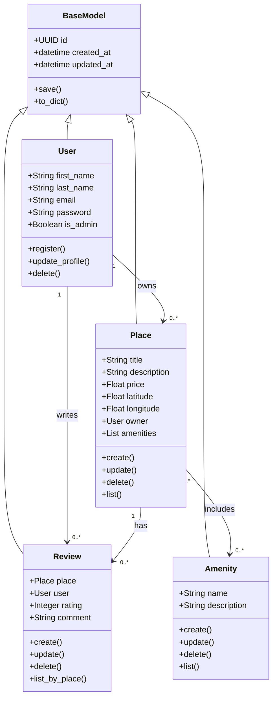
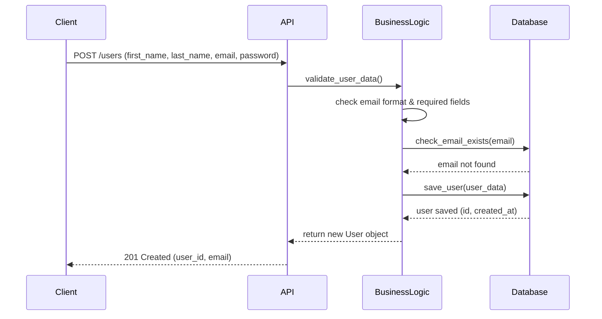
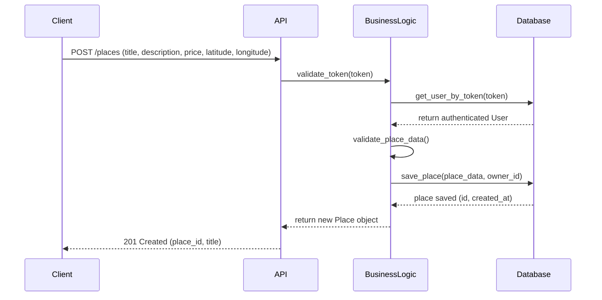
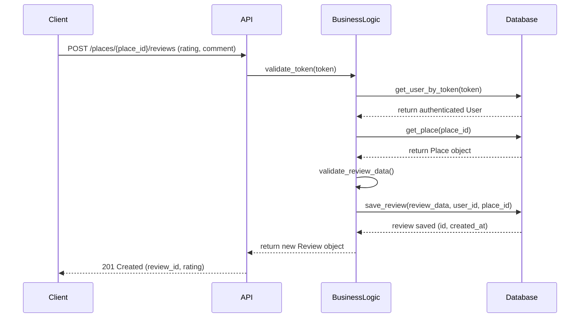
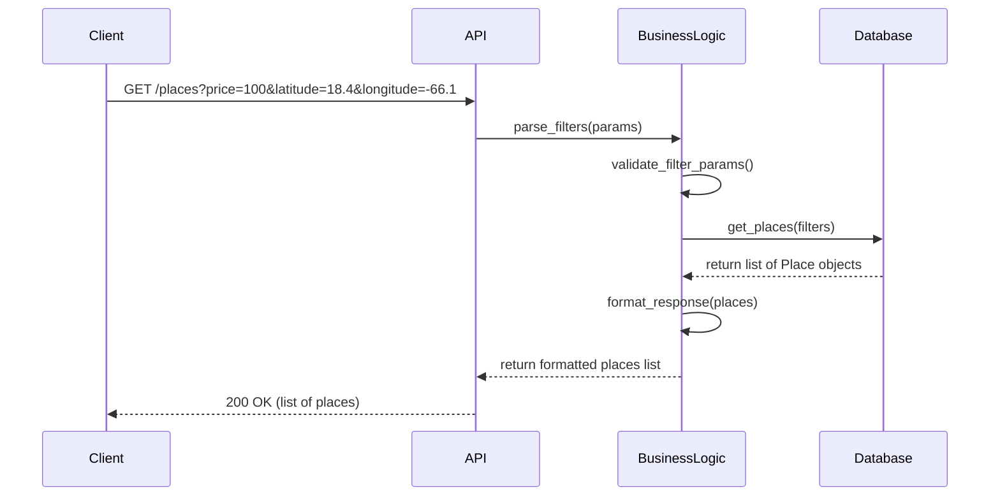

---

## Task 1: Detailed Class Diagram — Business Logic Layer

### Overview
All entities inherit from a BaseModel that provides common attributes.
The diagram shows the four main entities and their relationships.

### Entity Descriptions

**BaseModel** — Base class for all entities. Provides `id`, `created_at`, and `updated_at`.

**User** — Represents registered users. Can be admin or regular user.

**Place** — A property listed by a user. Has amenities and receives reviews.

**Review** — Written by a user about a specific place. Includes rating and comment.

**Amenity** — A feature that can be associated with multiple places.

---
---

## Task 2: Sequence Diagrams for API Calls

---

### 1. User Registration

**Description:** The client sends user data to the API. The Business Logic validates
the input and checks for duplicate emails. If valid, the user is saved to the database
and a success response is returned.

---

### 2. Place Creation

**Description:** An authenticated user sends place details. The API verifies the
user token, the Business Logic validates the data, and the place is saved with the
owner reference. A success response with the new place ID is returned.

---

### 3. Review Submission

**Description:** An authenticated user submits a review for a specific place.
The Business Logic verifies both the user and the place exist, validates the
review data, and saves it linked to both the user and place.

---

### 4. Fetching a List of Places

**Description:** A client requests a list of places with optional filters such as
price and location. The Business Logic validates and parses the filters, queries
the database, formats the results, and returns the list to the client.

---